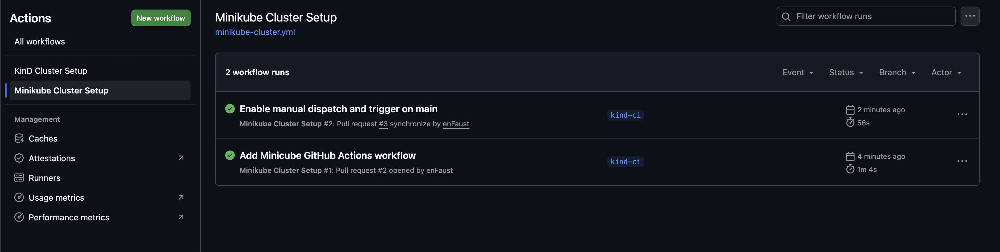

# Kubernetes CI Clusters (KinD & Minikube)

This folder contains GitHub Actions workflows and command history
for setting up Kubernetes clusters using KinD and Minikube.

## Cluster Summary

| Cluster   | Nodes | Kubernetes Version | Startup Time |
|-----------|-------|--------------------|--------------|
| KinD      | 1     | v1.29+             | ~1–2 min     |
| Minikube  | 1     | v1.35.1            | ~3–5 min     |

## Notes
- Both clusters are single-node setups.
- KinD is optimized for CI and starts faster.
- Minikube provides a more feature-complete local Kubernetes environment.

